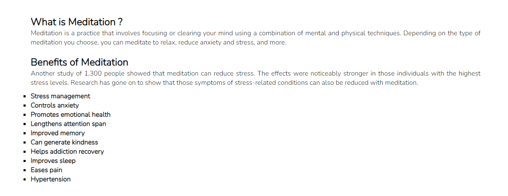
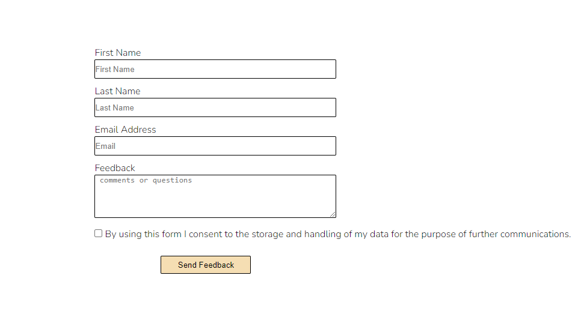

# Meditation

- This website will introduce you to different types of meditation.
- This website will also introduce you to the various benefits of meditation.
- This website provides a simple login, where users easily can become a member of the meditation community.

 

## Features

### Existing Features

- __Navigation bar__
   
   - The full responsive navigation bar includes links to the Logo, Home page, Types of Meditation and Contact form.
   - This section will allow the user to easily navigate the site.

- __Home page section__

     - This section will introduce users with Meditation and what Meditation really is.
     - This section will provide users some Meditation benefits.

- __Types of Meditation__

     - This section will introduce users with some simple types of Meditation practice.

- __Contact__

     - Contact form will allow user to easly sign up to the page, and join the Meditation community.
     - Contact form will also allow feedback for user to leave comment or ask the question.

- __Back to top__

     - Back to top feature will allow user to easily jump from the bottom of the page to the top.

 ## Typography 

   - I used the Google Font called 'Nunito, sans-serif' for the Meditation site.

   - [Nunito](https://fonts.google.com/specimen/Nunito+Sans)

## Tools & Technologies

- [HTML](https://en.wikipedia.org/wiki/HTML) used for main page content.
- [CSS](https://en.wikipedia.org/wiki/CSS) layout and desing.
- [GIT](https://git-scm.com) version control system (Git add , Git commit and Git push).
- [GitHub](https://github.com) used for - create, change, merge, and collaborate with files and code.
- [GutHub Pages](https://pages.github.com) used for hosting the page.
- [VsCode](https://code.visualstudio.com/) used for operations like debugging, task running, and version control.
- [Google Fonts](https://fonts.google.com/) used for downloading suitable font.

### Validator testing

- HTML
   - No errors were returned when passing through the official [W3C Validator](https://dino-code94.github.io/Project-1/](https://validator.w3.org/nu/?doc=https%3A%2F%2Fdino-code94.github.io%2FProject-1%2Findex.html)
- CSS
   - No errors were returned when passing through the official [W3C Validator](https://jigsaw.w3.org/css-validator/](https://jigsaw.w3.org/css-validator/validator?uri=https%3A%2F%2Fdino-code94.github.[…]&profile=css3svg&usermedium=all&warning=1&vextwarning=&lang=en)

## Credits

### Content

  - The text for the home page was taken from online resources such as Wikipedia.
  - The text for the Types of Meditation was taken from Google research, Wikipedia.

### Media 

  - The main picture and the logo were taken from the [Google Images](https://www.google.com/search?sca_esv=a135d1cef58d6723&rlz=1C1VDKB_enAT1101AT1101&q=meditation+photos&udm=2&fbs=AEQNm0Aa4sjWe7Rqy32pFwRj0UkWd8nbOJfsBGGB5IQQO6L3J_86uWOeqwdnV0yaSF-x2jonhbbcqQszH7grY4dWHpFLuEUA-tY2uH58eTxd9cqGwlXKW7EXjMiTglRC74-mGMvfO8ygkzIUEqIY9OuxUHgovBkmc1vow1hnZ7Jqd0guJVhN-vM&sa=X&sqi=2&ved=2ahUKEwiut7D5p66HAxWhExAIHYZCFfgQtKgLegQIEhAB&biw=1920&bih=945&dpr=1)

## Deployment

- The site was deployed to GitHub pages as follows:

 - In the GitHub repository, navigate to the Settings tab
 - Open the "Pages" page in the sidebar
 - From the source section drop-down menu, select the Main Branch
 - Once the Main branch has been selected, the page will be automatically refreshed with a detailed ribbon display to indicate the successful deployment.

The live link can be found here: https://dino-code94.github.io/Project-1

